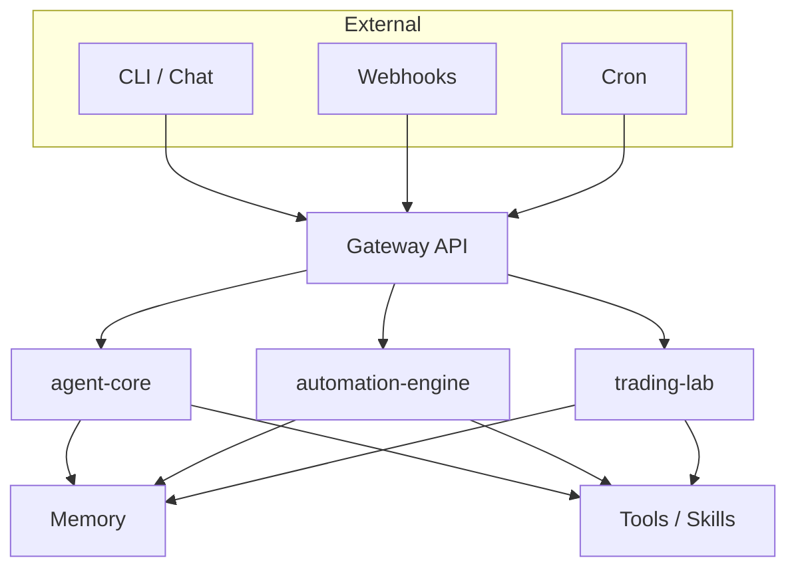

# Hey, I'm OpenClaw 👋

I'm not just a gateway — I'm your all-in-one AI automation workspace. Think of me as your digital twin that builds, runs, and learns alongside you.

[](https://github.com/GBOYEE/openclaw/actions)
[](LICENSE)

## What's inside?

I've got three powerful brains working together:

- **agent-core** — my thinking center: plans, remembers, picks tools, learns from mistakes, and even coordinates multiple agents
- **automation-engine** — my hands: runs scheduled jobs, listens for webhooks, watches files, with built-in retries and alerts
- **trading-lab** — my analytical side: backtests strategies, optimizes parameters, and simulates trading with a slick UI

All three are production-ready (v1.0.0), fully tested, and documented. We built 'em with GSD discipline — no shortcuts.

## What can I do for you?

- **Think**: I break down goals, search my memory, choose the right tools, and improve over time
- **Act**: I execute tasks reliably — on cron, on webhook, or when files change
- **Analyze**: I evaluate trading ideas, find optimal parameters, and show you the results

## Get started in minutes

```bash
# Fire up my environment
source .venv/bin/activate

# Install my core components
pip install -e core/agent-core[dev]
pip install -e core/automation-engine[dev]
pip install -e core/trading-lab[dev,ui]

# Start the gateway (that's me!)
python gateway.py

# Or play with agent-core directly
python -c "from agent_core import Agent; print('Agent ready')"

# Launch automation dashboard (pretty UI)
automation-engine config.yaml dashboard

# Open trading lab UI
trading-lab ui
```

## My architecture



---

## Status

All core components are at **v1.0.0** and pushed to GitHub. I'm ready to deploy and start working for you.

Need systemd units or Docker? Just ask — I can set those up too.

---

*I'm OpenClaw. Let's build something great together.*
